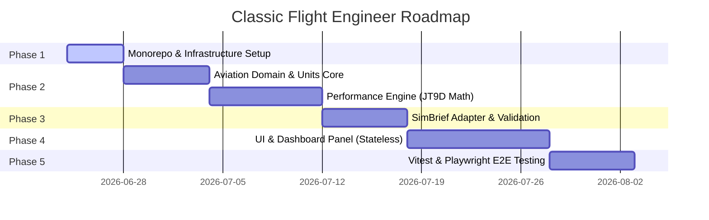

# Project Roadmap: Classic Flight Engineer

This document outlines the phased development path for the **Classic Flight Engineer** application.

---

## Phased Execution Plan

### Phase 1: Workspace Scaffolding & Shared Tools (Current Phase)
- **Goal**: Initialize pnpm workspace and configure developer environments.
- **Deliverables**:
  - `package.json` workspace config.
  - ESLint, Prettier, and root TypeScript base templates.
  - Setup Vitest base configurations.

### Phase 2: Aviation Domain & Performance Math (Core Logic)
- **Goal**: Build the mathematical foundation for Boeing 747-200.
- **Deliverables**:
  - `packages/aviation-domain` types and interfaces.
  - `packages/unit-system` branded types and audited converters.
  - `packages/aircraft-data` tabular profiles (EPR target lookup, fuel burn, V-speeds).
  - `packages/performance-engine` functions:
    - ISA atmospheric model.
    - Takeoff V-speed interpolations.
    - Cruise power configurations.

### Phase 3: External Integration & Session Flow
- **Goal**: Standardize inputs from SimBrief and validate data structures.
- **Deliverables**:
  - `packages/simbrief-adapter` with XML/JSON normalization.
  - `packages/validation` input check rules using Zod schemas.

### Phase 4: Web Frontend & User Interface
- **Goal**: Build the interactive glass cockpit dashboard.
- **Deliverables**:
  - `apps/web` React/Tailwind frontend pages.
  - `packages/ui` core panels (checklists, fuel visualizer, coordinate helper).
  - React Hook Form integrations with Tailwind styles.

### Phase 5: Verification & Quality Assurance
- **Goal**: End-to-end integration verification.
- **Deliverables**:
  - Vitest unit testing coverage > 90% in `performance-engine`.
  - Playwright scripts verifying the SimBrief import E2E flow.
