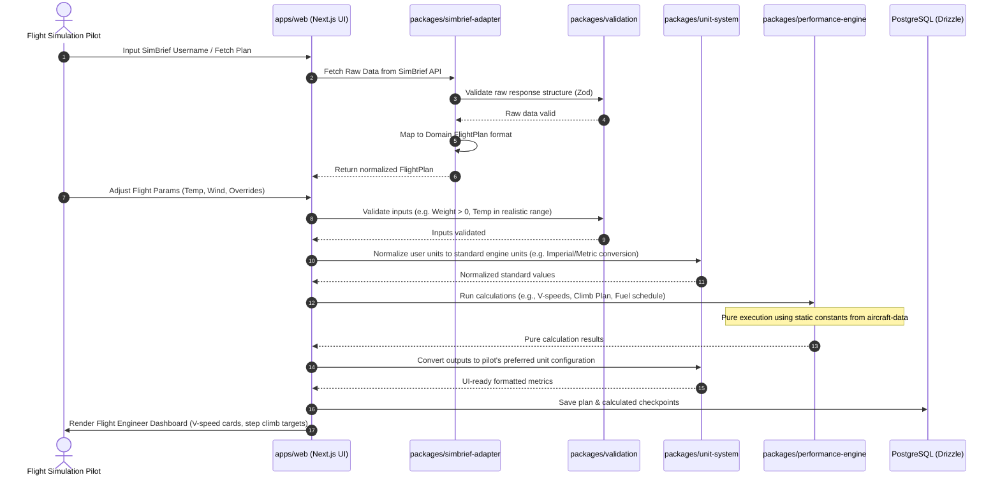

# System Data Flow and Lifecycle

This document describes how flight data, user parameters, and calculation results flow through the **Classic Flight Engineer** system.

## Data Flow Diagram

## Data Lifecycle States

To maintain code cleanliness, objects passing through calculations transition through clear states:

1. **Raw External State**: Unstructured JSON received from SimBrief. Must be validated immediately by `simbrief-adapter` before being touched.
2. **Normalized Domain State**: Represented by strict TypeScript interfaces in `aviation-domain`. All values are typed and mapped (e.g., standardizing flight plan coordinates to a unified GPS interface).
3. **Internal Standard Unit State**: Internal calculations (e.g., in `performance-engine`) execute in standard units to avoid conversion noise.
   - Temperature: Kelvin/Celsius depending on ISA formula requirement.
   - Weight: Pounds (lbs) for B747 calculations, or standard SI units.
   - Distance: Nautical Miles (NM).
   - Altitude: Feet (ft) / Flight Level (FL).
4. **User-Preferred Presentation State**: Converted at the UI boundary. If a pilot prefers KG and hPa, the display handles this layer of conversion, keeping calculations safe.
