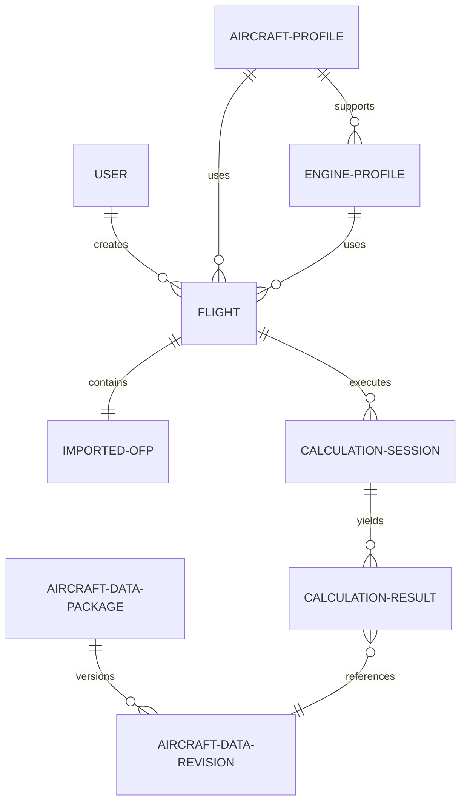

# Database Architecture & Schema Design

Classic Flight Engineer uses PostgreSQL as its data persistence layer, managed via **Drizzle ORM**.

## Entities ERD

## Schema Definitions

### 1. `User`
Stores registration, preferences, and session indicators.
- `id`: UUID (Primary Key)
- `email`: VARCHAR (Unique)
- `name`: VARCHAR
- `unitPreference`: VARCHAR (e.g. "imperial" | "metric")

### 2. `AircraftProfile`
Defines supported airframes (e.g., B747-200, B727-200).
- `id`: UUID (Primary Key)
- `icaoCode`: VARCHAR (e.g. "B742")
- `name`: VARCHAR (e.g. "Boeing 747-200 Classic")
- `manufacturer`: VARCHAR

### 3. `EngineProfile`
A aircraft variant can support multiple engine profiles.
- `id`: UUID (Primary Key)
- `aircraftProfileId`: UUID (Foreign Key -> AircraftProfile)
- `name`: VARCHAR (e.g. "Pratt & Whitney JT9D-7A")
- `thrustRating`: VARCHAR

### 4. `Flight`
Represents an individual flight entry.
- `id`: UUID (Primary Key)
- `userId`: UUID (Foreign Key -> User)
- `aircraftProfileId`: UUID (Foreign Key -> AircraftProfile)
- `engineProfileId`: UUID (Foreign Key -> EngineProfile)
- `normalizedContext`: JSONB (FlightContext type structure)
- `createdAt`: TIMESTAMP

### 5. `ImportedOFP`
Stores raw operational flight plans (OFP) from SimBrief to allow recalculations or reference audits.
- `id`: UUID (Primary Key)
- `flightId`: UUID (Foreign Key -> Flight)
- `rawJson`: JSONB (Unaltered SimBrief response)
- `rawXml`: TEXT
- `importedAt`: TIMESTAMP

### 6. `CalculationSession`
Group of calculations performed during a flight's operational timeline (e.g., Pref, Cruise Step-Climb tracking).
- `id`: UUID (Primary Key)
- `flightId`: UUID (Foreign Key -> Flight)
- `sessionType`: VARCHAR (e.g. "takeoff" | "climb" | "cruise")
- `createdAt`: TIMESTAMP

### 7. `CalculationResult`
Saves calculated mathematical outcomes and performance metrics.
- `id`: UUID (Primary Key)
- `sessionId`: UUID (Foreign Key -> CalculationSession)
- `inputs`: JSONB (Calculation input variables)
- `outputs`: JSONB (Calculation outputs)
- `engineVersion`: VARCHAR (Version tag of math engine)
- `dataRevisionId`: UUID (Foreign Key -> AircraftDataRevision)
- `calculatedAt`: TIMESTAMP

### 8. `AircraftDataPackage`
Logical grouping of aircraft-specific static performance tables.
- `id`: UUID (Primary Key)
- `aircraftProfileId`: UUID (Foreign Key -> AircraftProfile)
- `engineProfileId`: UUID (Foreign Key -> EngineProfile)
- `packageName`: VARCHAR (e.g. "JT9D-7A-climb-performance")

### 9. `AircraftDataRevision`
Historical revision tracker of aircraft performance data models.
- `id`: UUID (Primary Key)
- `packageId`: UUID (Foreign Key -> AircraftDataPackage)
- `revisionTag`: VARCHAR (e.g. "v1.0.0")
- `rawTables`: JSONB (Aviation polynomials/curves)
- `createdAt`: TIMESTAMP
