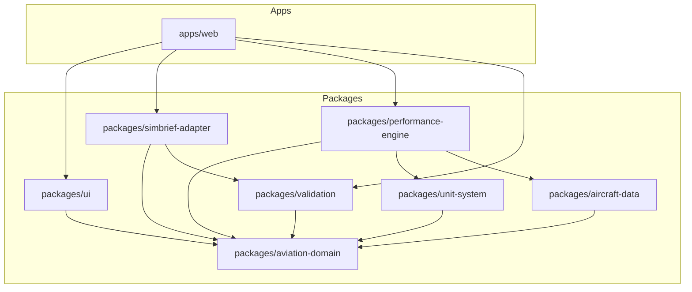

# Monorepo Modules and Package Responsibilities

Classic Flight Engineer is structured as a monorepo containing one application (`apps/web`) and several localized packages (`packages/*`). This enforces strict dependency boundaries and modular design.

## Module Registry & Descriptions

### 1. `apps/web`
- **Type**: Next.js App
- **Responsibilities**:
  - Handles HTTP routing, page rendering (SSR/ISR/CSR), and user sessions.
  - Exposes API routes for SimBrief fetch requests and DB persistence.
  - Connects to PostgreSQL database via Drizzle ORM.
  - Manages application-level React state and orchestrates calculations.
- **Allowed Dependencies**: `packages/ui`, `packages/performance-engine`, `packages/simbrief-adapter`, `packages/validation`, `packages/aviation-domain`.

### 2. `packages/aviation-domain`
- **Type**: TypeScript Shared Package
- **Responsibilities**:
  - Defines the core interfaces, types, and schemas for flight models, plans, airports, waypoints, and weather.
  - Zero logic or calculations; strictly contains type and interface definitions.
- **Allowed Dependencies**: None (leaf node).

### 3. `packages/performance-engine`
- **Type**: Pure TypeScript Math Package
- **Responsibilities**:
  - Implements pure, deterministic functions for aviation math:
    - ISA (International Standard Atmosphere) calculations (temperature, pressure, density ratios).
    - Climb performance profiles (Time, Fuel, Distance to Climb).
    - Takeoff / Landing V-speed interpolation.
    - Cruise drag, EPR target, and fuel flow integration.
  - **No external I/O** allowed (no DB, no network, no window/browser API, no env variables).
- **Allowed Dependencies**: `packages/aviation-domain`, `packages/unit-system`, `packages/aircraft-data`.

### 4. `packages/aircraft-data`
- **Type**: TypeScript Data & Registry Package
- **Responsibilities**:
  - Houses the static performance tables, polynomial coefficients, and curves for different aircraft types and engines (starting with B747-200 JT9D).
  - Encapsulates tabular data and exposes clean query functions (e.g., `getClimbDataForWeight(weight)`).
- **Allowed Dependencies**: `packages/aviation-domain`.

### 5. `packages/simbrief-adapter`
- **Type**: TypeScript Parsing & Translation Package
- **Responsibilities**:
  - Fetches and parses raw XML/JSON data from the SimBrief API.
  - Maps external fields to the internal, standard flight planning structures of `packages/aviation-domain`.
  - Isolatess the application from upstream API changes (if SimBrief changes its JSON schema, only this adapter changes).
- **Allowed Dependencies**: `packages/aviation-domain`, `packages/validation`.

### 6. `packages/unit-system`
- **Type**: TypeScript Safety Package
- **Responsibilities**:
  - Ensures type-safe unit wrapping (preventing logical errors like mixing Lbs/Kgs, hPa/inHg, or Feet/Meters).
  - Implements highly audited unit converters.
- **Allowed Dependencies**: `packages/aviation-domain`.

### 7. `packages/validation`
- **Type**: TypeScript Schema Validation Package
- **Responsibilities**:
  - Implements strict validation constraints using Zod.
  - Checks flight plans, weights, and environmental parameters before they reach the database or calculation engines.
- **Allowed Dependencies**: `packages/aviation-domain`.

### 8. `packages/ui`
- **Type**: React & Tailwind UI Component Library
- **Responsibilities**:
  - Exposes shared, reusable design system components (buttons, input fields, layouts, status cards, tables).
- **Allowed Dependencies**: `packages/aviation-domain`.
