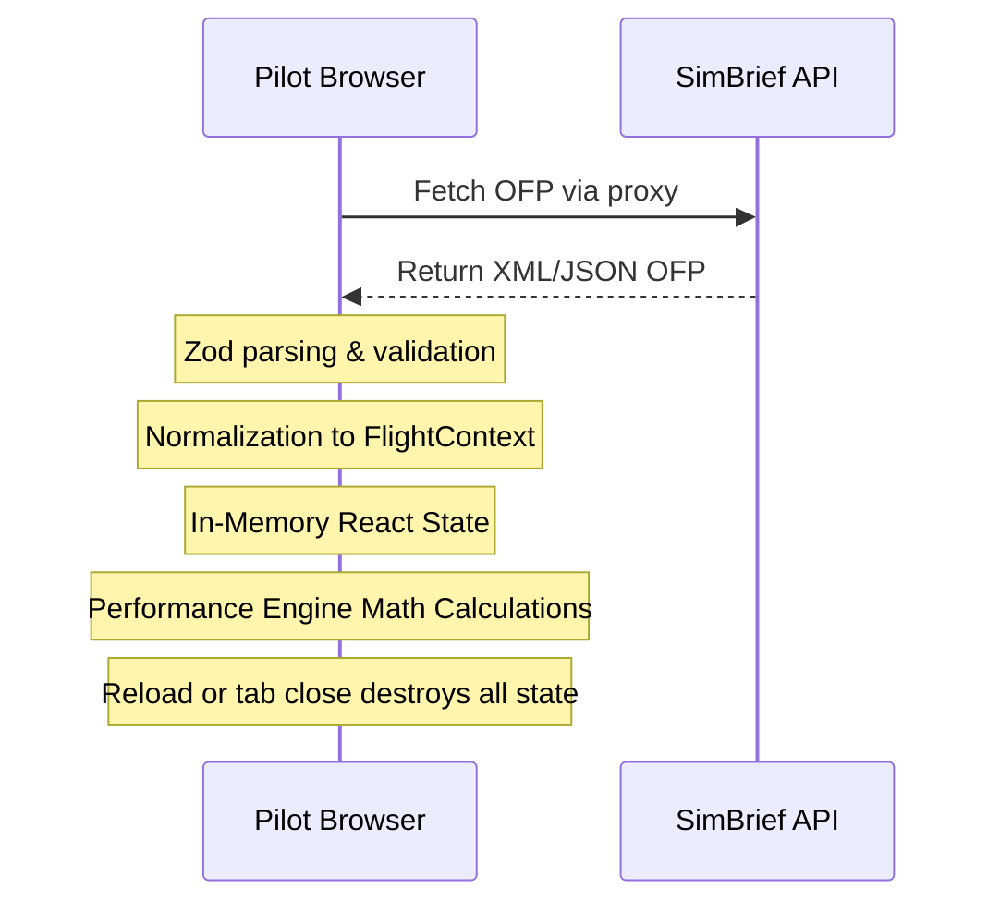

# Stateless Architecture

Classic Flight Engineer is designed to be a fully **stateless** helper application. No persistent databases, server files, or localStorage states are utilized.

## Data Lifecycle

### Core Architecture Rules

1. **Zero Database Integration**: The system runs entirely in memory without writing data to disk, relational databases, or server-side repositories.
2. **Session Lifespan**: All flight information, import parameters, and custom variables live only within active React states. Closing the browser window or reloading the page discards all loaded information.
3. **No Local Persistence**: The use of `localStorage`, `IndexedDB`, or cookies is prohibited for persisting flight context profiles or configurations.
4. **Pure Calculation Engine**: Calculations inside `packages/performance-engine` are completely pure and stateless, relying exclusively on variables provided as parameters.
